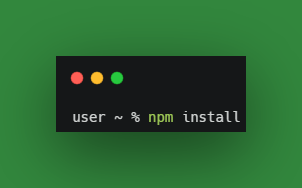
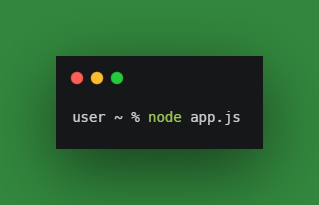

# Campgrounds


Campgrounds is a node.js based webapp where people can upload new campground sites, view and provide review for the existing campground sites.

This webapp fully handles all the aspects of modern webapp's such as:

```
- Authentication and Authorization for users
- Express Router and cookie managment
- Complex database to handle multiple collections such as User credentials,
  campground information and reviews by the user
```
<br>
<br>

>There are two methods two run this app one is by running the already deployed app on server:

Link to the deployed app:

[Campgrounds](https://immense-gorge-84783.herokuapp.com/)
<br>
## How to run the webapp on local machine:
- install all the dependencies with the command:
  
  
- get mongoose running on your computer and then add the following code (port can vary according to your pc):
  ```javascript
    mongoose.connect('mongodb://localhost:27017/yelp-camp')
  ```
- make a env file and get your cloudinary api keys to have cloud storage for your images do the same for mapbox. Example of .env file:
  ```env
      CLOUDINARY_CLOUD_NAME=__________________
      CLOUDINARY_KEY=__________________
      CLOUDINARY_SECRET=_____________________
      MAPBOX_TOKEN=______________________
  ```
- to run :

  